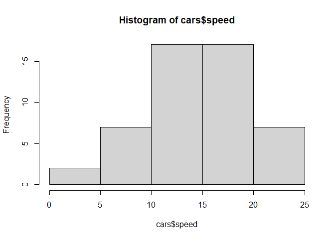
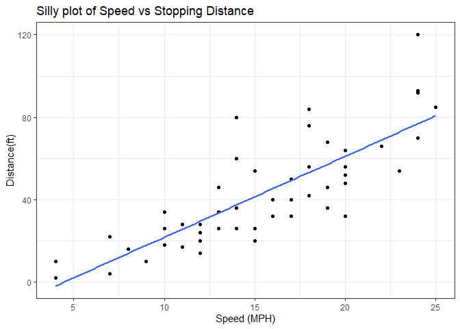
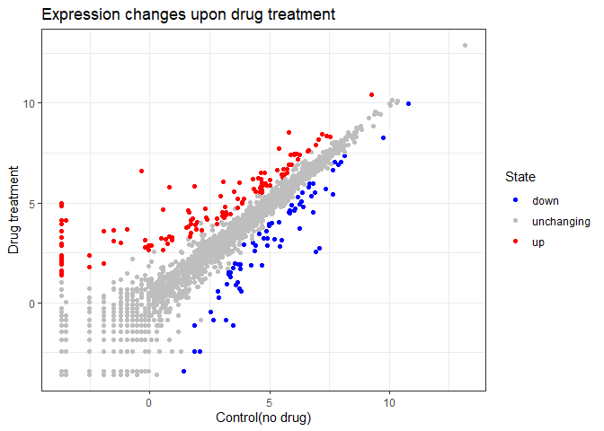
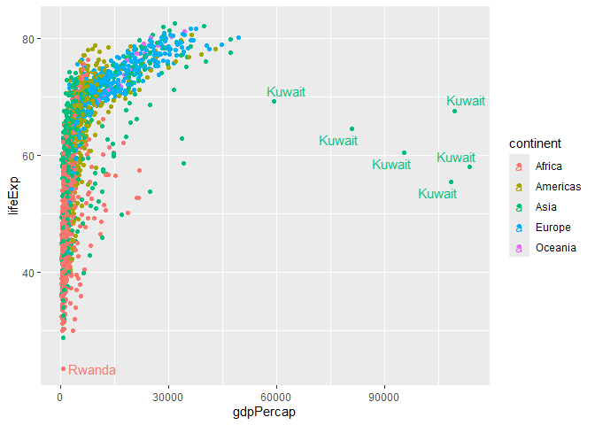
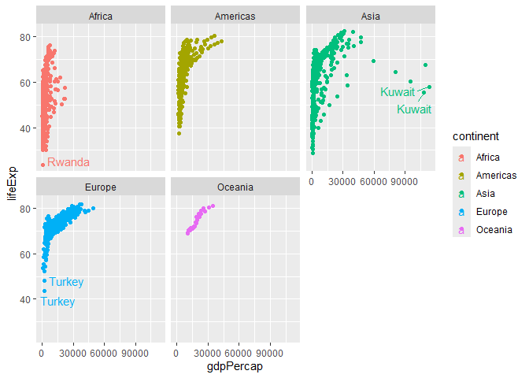

# Class 5: Data Visualization
Peyton Chiu (PID:18145937)

Today we are exploring the **ggplot** package and how to make nice
figures in R,

There are lots of ways to make figures and plots in R. These include:

-so called “base” R -and add on packages like **ggplot**

Here is a simple “base” R plot.

``` r
head(cars)
```

      speed dist
    1     4    2
    2     4   10
    3     7    4
    4     7   22
    5     8   16
    6     9   10

We can simply pass to the ‘plot()’ function.

``` r
plot(cars)
```


> Key point: Base R is quick but not so nice looking in some folks eyes.

Let’s see how we can plot this with **ggplot**

1st I need to install this add-on package. For this we use the
‘install.packages()’ function. -**WE DO THIS IN THE CONSOLE, NOT OUR
REPORT**. This is a one time only deal.

2nd we need to load the package with the “library()” function everytime
we want to use it.

``` r
library(ggplot2)
```

    Warning: package 'ggplot2' was built under R version 4.4.3

``` r
ggplot(cars)
```


Every ggplot is composed of at least 3 layers:

\-**data**(i.e. a data.frame with the things you want to plot).

-aesthetics **aes()** that map the columns of data to your plot features
(i.e. aesthetics)

-geoms like **geom.point()** that srt how the plot appears

``` r
ggplot(cars)+
  aes(x=speed, y=dist)+
  geom_point()
```


``` r
hist(cars$speed)
```



> For simple “canned” graphs base R is quicker but as things get more
> custom and elaborate then ggplot wins out

Let’s add more layers to our ggplot

Add a line showing the relationship between x and u Add a title Add
custom axis labels “Speed(MPH) and Distance (feet) Change the theme.

``` r
ggplot(cars)+
  aes(x=speed, y=dist)+
  geom_point() +
  geom_smooth(method = "lm", se = FALSE)+
  labs(title = "Silly plot of Speed vs Stopping Distance", x="Speed (MPH)", y = "Distance(ft)" )+
  theme_bw()
```

    `geom_smooth()` using formula = 'y ~ x'



## Going further

Read some gene expression data

``` r
url <- "https://bioboot.github.io/bimm143_S20/class-material/up_down_expression.txt"
genes <- read.delim(url)
head(genes)
```

            Gene Condition1 Condition2      State
    1      A4GNT -3.6808610 -3.4401355 unchanging
    2       AAAS  4.5479580  4.3864126 unchanging
    3      AASDH  3.7190695  3.4787276 unchanging
    4       AATF  5.0784720  5.0151916 unchanging
    5       AATK  0.4711421  0.5598642 unchanging
    6 AB015752.4 -3.6808610 -3.5921390 unchanging

``` r
nrow(genes)
```

    [1] 5196

``` r
ncol(genes)
```

    [1] 4

> Q2: How many genes are in this dataset

> Q3: How many “up” regulated genes are there?

``` r
sum(genes$State =="up")
```

    [1] 127

A useful function for counting up occurences of things in a vector is
the ‘table()’ function

``` r
table(genes$State)
```


          down unchanging         up 
            72       4997        127 

Make a V1 figure

``` r
p<- ggplot(genes) +
  aes(Condition1, Condition2, colour = State)+
  geom_point()+
  labs(y="Drug treatment", x = "Control(no drug)")
```

``` r
p + scale_colour_manual( values=c("blue","gray","red") )+
  labs(title="Expression changes upon drug treatment") +
  theme_bw()
```



## More plotting

Read in the gapminder dataset

``` r
# File location online
url <- "https://raw.githubusercontent.com/jennybc/gapminder/master/inst/extdata/gapminder.tsv"

gapminder <- read.delim(url)
```

Let’s have a small peek

``` r
head(gapminder, n=3)
```

          country continent year lifeExp      pop gdpPercap
    1 Afghanistan      Asia 1952  28.801  8425333  779.4453
    2 Afghanistan      Asia 1957  30.332  9240934  820.8530
    3 Afghanistan      Asia 1962  31.997 10267083  853.1007

``` r
tail(gapminder, n=3)
```

          country continent year lifeExp      pop gdpPercap
    1702 Zimbabwe    Africa 1997  46.809 11404948  792.4500
    1703 Zimbabwe    Africa 2002  39.989 11926563  672.0386
    1704 Zimbabwe    Africa 2007  43.487 12311143  469.7093

> Q4: How many countries are in this dataset

``` r
length(table(gapminder$country))
```

    [1] 142

> Q5: How many continents are in this dataset

``` r
unique(gapminder$continent)
```

    [1] "Asia"     "Europe"   "Africa"   "Americas" "Oceania" 

``` r
ggplot(gapminder)+
  aes(gdpPercap, lifeExp, colour = continent)+
  geom_point()
```


``` r
library(ggrepel)
```

    Warning: package 'ggrepel' was built under R version 4.4.3

``` r
ggplot(gapminder)+
  aes(gdpPercap, lifeExp, colour = continent, label =country)+
  geom_point()
```


I can use **ggrepl** to make more sensible labels

``` r
library(ggrepel)
ggplot(gapminder)+
  aes(gdpPercap, lifeExp, colour = continent, label =country)+
  geom_point()+
  geom_text_repel()
```

    Warning: ggrepel: 1697 unlabeled data points (too many overlaps). Consider
    increasing max.overlaps



I want a separate panel per continent

``` r
ggplot(gapminder)+
  aes(gdpPercap, lifeExp, colour = continent, label =country)+
  geom_point()+
  geom_text_repel()+
  facet_wrap(~continent)
```

    Warning: ggrepel: 623 unlabeled data points (too many overlaps). Consider
    increasing max.overlaps

    Warning: ggrepel: 358 unlabeled data points (too many overlaps). Consider
    increasing max.overlaps

    Warning: ggrepel: 300 unlabeled data points (too many overlaps). Consider
    increasing max.overlaps

    Warning: ggrepel: 24 unlabeled data points (too many overlaps). Consider
    increasing max.overlaps

    Warning: ggrepel: 394 unlabeled data points (too many overlaps). Consider
    increasing max.overlaps



## Summary : What are the advantages of ggplot over base R

Layered Grammar of Graphics: ggplot uses a consistent, layered approach
(data, aesthetics, geometry) for building plots, making it easier to
create complex visualizations by adding layers step-by-step. Base R
requires different functions and arguments for each plot type, which can
be less intuitive and harder to customize for complex figures 1, 3, 2,
5, 7.

Publication-Quality Defaults: ggplot produces attractive,
publication-ready figures with sensible defaults, while base R often
needs extensive tweaking to achieve similar aesthetics 1, 3, 2, 5.

Declarative Syntax: In ggplot, you declare what you want to show (e.g.,
which variables map to which aesthetics), rather than specifying every
detail procedurally. This makes code easier to read and modify 1, 3, 2,
5.

Faceting and Grouping: ggplot makes it straightforward to split data
into subplots (facets) and to map variables to color, shape, or other
aesthetics, which is much more cumbersome in base R 3, 2.

Extensibility: ggplot is part of a large ecosystem of packages for
advanced graphics and customizations, while base R is more limited in
scope 1, 3, 5.
