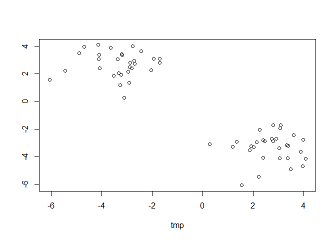
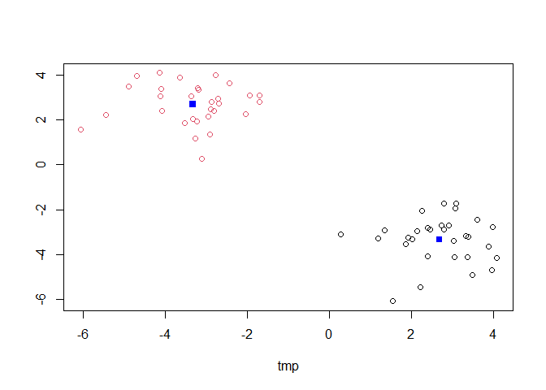
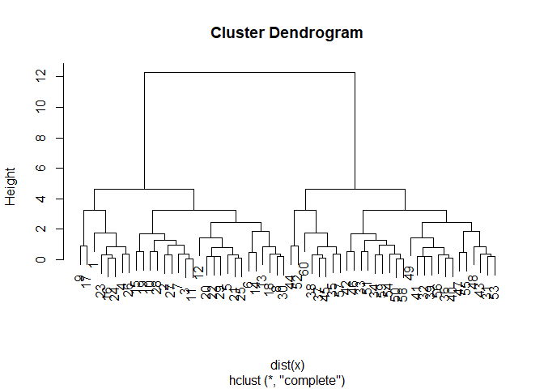
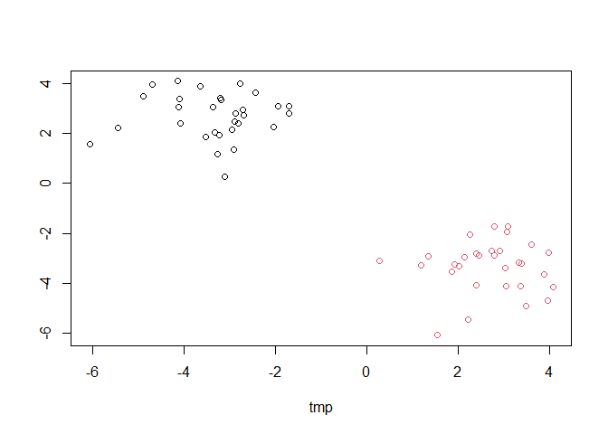
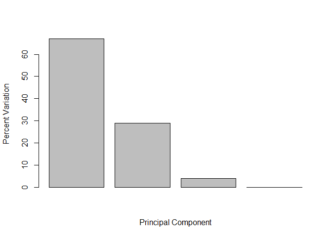
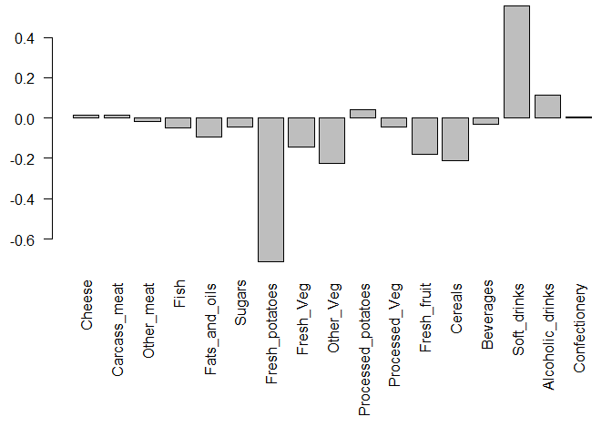

# Class07Lab
Peyton Chiu (PID:A18145937)

# First up kmeans()

Demo od using kmeans() function in base R. First, make up some data with
a known structure.

``` r
tmp <- c( rnorm(30,-3), rnorm(30,3))
x <- cbind(tmp, rev(tmp))
plot(x)
```



Now we have some made up data in `x` let’s see how kmeans works with
this data

``` r
k<- kmeans(x, centers =2, nstart =20)
k
```

    K-means clustering with 2 clusters of sizes 30, 30

    Cluster means:
            tmp          
    1  2.691765 -3.329484
    2 -3.329484  2.691765

    Clustering vector:
     [1] 2 2 2 2 2 2 2 2 2 2 2 2 2 2 2 2 2 2 2 2 2 2 2 2 2 2 2 2 2 2 1 1 1 1 1 1 1 1
    [39] 1 1 1 1 1 1 1 1 1 1 1 1 1 1 1 1 1 1 1 1 1 1

    Within cluster sum of squares by cluster:
    [1] 54.84538 54.84538
     (between_SS / total_SS =  90.8 %)

    Available components:

    [1] "cluster"      "centers"      "totss"        "withinss"     "tot.withinss"
    [6] "betweenss"    "size"         "iter"         "ifault"      

> > Q. How many points are in each cluster

``` r
k$size
```

    [1] 30 30

> Q. How do we get to the cluster membership

``` r
k$cluster
```

     [1] 2 2 2 2 2 2 2 2 2 2 2 2 2 2 2 2 2 2 2 2 2 2 2 2 2 2 2 2 2 2 1 1 1 1 1 1 1 1
    [39] 1 1 1 1 1 1 1 1 1 1 1 1 1 1 1 1 1 1 1 1 1 1

> Q. What about cluster centers

``` r
k$centers 
```

            tmp          
    1  2.691765 -3.329484
    2 -3.329484  2.691765

Now we’ve got to the main results, let’s use them to plot our data with
the k-means result

``` r
plot(x, col =k$cluster)
points(k$centers, col ="blue", pch=15)
```



## Now for hclust()

We will cluster the same data `x` with the `hclust()`. In this case
`hclust()` requires a distance matrix input

``` r
hc<- hclust(dist(x))
hc
```


    Call:
    hclust(d = dist(x))

    Cluster method   : complete 
    Distance         : euclidean 
    Number of objects: 60 

Let’s plot our hclust result

``` r
plot(hc)
```



To get our cluster membership vector we need to “cut the tree with the
`cutree()`

``` r
grps<- cutree(hc, h=8)
grps
```

     [1] 1 1 1 1 1 1 1 1 1 1 1 1 1 1 1 1 1 1 1 1 1 1 1 1 1 1 1 1 1 1 2 2 2 2 2 2 2 2
    [39] 2 2 2 2 2 2 2 2 2 2 2 2 2 2 2 2 2 2 2 2 2 2

Now plot our data with the hclust() results

``` r
plot(x, col =grps)
```



# Principal Component Analysis (PCA)

## PCA of UK food data

Read data from website and try a few visualizations

``` r
url <- "https://tinyurl.com/UK-foods"
x <- read.csv(url, row.names = 1)
x
```

                        England Wales Scotland N.Ireland
    Cheese                  105   103      103        66
    Carcass_meat            245   227      242       267
    Other_meat              685   803      750       586
    Fish                    147   160      122        93
    Fats_and_oils           193   235      184       209
    Sugars                  156   175      147       139
    Fresh_potatoes          720   874      566      1033
    Fresh_Veg               253   265      171       143
    Other_Veg               488   570      418       355
    Processed_potatoes      198   203      220       187
    Processed_Veg           360   365      337       334
    Fresh_fruit            1102  1137      957       674
    Cereals                1472  1582     1462      1494
    Beverages                57    73       53        47
    Soft_drinks            1374  1256     1572      1506
    Alcoholic_drinks        375   475      458       135
    Confectionery            54    64       62        41

> **Q1**. How many rows and columns are in your new data frame
> named `x`? What R functions could you use to answer this questions?

``` r
dim(x)
```

    [1] 17  4

There are the 17 rows and 4 columns

> **Q2.** Which approach to solving the ‘row-names problem’ mentioned
> above do you prefer and why? Is one approach more robust than another
> under certain circumstances?

I prefer to use the `row.names=1` argument as it only has to add one
line of code. Additionally, if you use the other approach and repeat you
would end up corrupting the data as the first column would be remove,
making you set the row names incorrectly.

``` r
cols <- rainbow(nrow(x))
barplot(as.matrix(x), col=cols)
```


> **Q3**: Changing what optional argument in the
> above **barplot()** function results in the following plot?

Changing the besides argument in your code to FALSE results in the plot
above. This because the different food types are stacked instead being
shown side by side.

``` r
barplot(as.matrix(x), col=cols, beside =TRUE)
```


``` r
pairs(x, col=cols)
```


> **Q5**: Generating all pairwise plots may help somewhat. Can you make
> sense of the following code and resulting figure? What does it mean if
> a given point lies on the diagonal for a given plot?

I can make some sense of the following code and resulting figure as I
know that is creating scatterplots of food consumption for all possible
countries against each other. If a given point lies on the diagonal for
a given plot, that means the country’s consumption of specific food item
is similar within both countries.

> **Q6**. What is the main differences between N. Ireland and the other
> countries of the UK in terms of this data-set?

Northern Ireland has more consumption of potatoes and less consumption
of fresh fruit and Alcoholic drinks compared to the other countries
based on this dataset.

PCA to the rescue

The main base R PCA function is called `prcomp()` and we will need to
give it the transpose of our input data

``` r
pca <- prcomp( t(x) )
summary(pca)
```

    Importance of components:
                                PC1      PC2      PC3       PC4
    Standard deviation     324.1502 212.7478 73.87622 3.176e-14
    Proportion of Variance   0.6744   0.2905  0.03503 0.000e+00
    Cumulative Proportion    0.6744   0.9650  1.00000 1.000e+00

``` r
attributes(pca)
```

    $names
    [1] "sdev"     "rotation" "center"   "scale"    "x"       

    $class
    [1] "prcomp"

To make our PCA plot (PCA score plot) we access `pca$X`

> **Q7**. Complete the code below to generate a plot of PC1 vs PC2. The
> second line adds text labels over the data points.

``` r
pca$x
```

                     PC1         PC2        PC3           PC4
    England   -144.99315   -2.532999 105.768945 -4.894696e-14
    Wales     -240.52915 -224.646925 -56.475555  5.700024e-13
    Scotland   -91.86934  286.081786 -44.415495 -7.460785e-13
    N.Ireland  477.39164  -58.901862  -4.877895  2.321303e-13

``` r
plot(pca$x[,1], pca$x[,2], xlab="PC1", ylab="PC2", xlim=c(-270,500))
text(pca$x[,1], pca$x[,2], colnames(x))
```


color up the plot

> **Q8.** Customize your plot so that the colors of the country names
> match the colors in our UK and Ireland map and table at start of this
> document.

``` r
country_cols <- c("orange", "red", "blue", "green")
plot(pca$x[,1],pca$x[,2], xlab = "PC1", ylab = "PC2")
text(pca$x[,1],pca$x[,2], colnames(x), col = country_cols)
```


``` r
v <- round( pca$sdev^2/sum(pca$sdev^2) * 100 )
v
```

    [1] 67 29  4  0

``` r
z <- summary(pca)
z$importance
```

                                 PC1       PC2      PC3          PC4
    Standard deviation     324.15019 212.74780 73.87622 3.175833e-14
    Proportion of Variance   0.67444   0.29052  0.03503 0.000000e+00
    Cumulative Proportion    0.67444   0.96497  1.00000 1.000000e+00

``` r
barplot(v, xlab="Principal Component", ylab="Percent Variation")
```



``` r
par(mar = c(10, 3, 0.35, 0))
barplot(pca$rotation[,2], las = 2)
```



> **Q9**: Generate a similar ‘loadings plot’ for PC2. What two food
> groups feature prominantely and what does PC2 maninly tell us about?

The two food groups that feature prominently are Soft drinks and Fresh
potatos. PC2 mainly tells us about differences between countries in
their consumption of these foods a country with a high PC2 score will
consume more Soft_drinks, while one with a low PC2 score will consume
more Fresh_potatoes.

## PCA of RNA-Seq Data

Read data from website

``` r
url2 <- "https://tinyurl.com/expression-CSV"
rna.data <- read.csv(url2, row.names=1)
head(rna.data)
```

           wt1 wt2  wt3  wt4 wt5 ko1 ko2 ko3 ko4 ko5
    gene1  439 458  408  429 420  90  88  86  90  93
    gene2  219 200  204  210 187 427 423 434 433 426
    gene3 1006 989 1030 1017 973 252 237 238 226 210
    gene4  783 792  829  856 760 849 856 835 885 894
    gene5  181 249  204  244 225 277 305 272 270 279
    gene6  460 502  491  491 493 612 594 577 618 638

> **Q10**: How many genes and samples are in this data set?

``` r
dim(rna.data)
```

    [1] 100  10

There are 100 genes and 10 samples in this dataset

``` r
pca<-prcomp(t(rna.data))
summary(pca)
```

    Importance of components:
                                 PC1     PC2      PC3      PC4      PC5      PC6
    Standard deviation     2214.2633 88.9209 84.33908 77.74094 69.66341 67.78516
    Proportion of Variance    0.9917  0.0016  0.00144  0.00122  0.00098  0.00093
    Cumulative Proportion     0.9917  0.9933  0.99471  0.99593  0.99691  0.99784
                                PC7      PC8      PC9      PC10
    Standard deviation     65.29428 59.90981 53.20803 2.647e-13
    Proportion of Variance  0.00086  0.00073  0.00057 0.000e+00
    Cumulative Proportion   0.99870  0.99943  1.00000 1.000e+00

Do our PCA plot of this RNA-seq data

``` r
plot(pca$x[,1],pca$x[,2],xlab="PC1",ylab="PC2")
```


``` r
plot(pca$x[,1],pca$x[,2],xlab="PC1",ylab="PC2")
text(pca$x[,1],pca$x[,2], colnames(rna.data))
```


